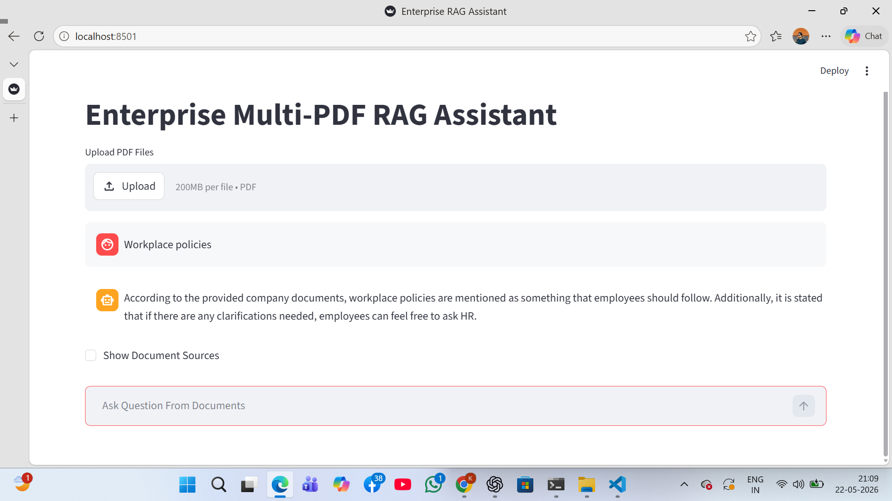
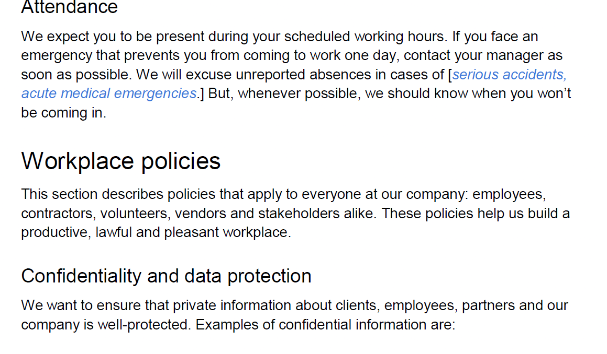

# Enterprise Multi-PDF RAG Assistant

Enterprise-grade Retrieval-Augmented Generation (RAG) AI Assistant built using open-source technologies including LangChain, Ollama, ChromaDB, and Streamlit.

This system allows users to interact with company internal documents and dynamically uploaded PDF files using semantic search and local Large Language Models (LLMs).

---

# Project Demo

## Features

- Multi PDF Upload
- Company Internal Knowledge Base
- User Uploaded Document Retrieval
- Enterprise RAG Pipeline
- Semantic Search
- Vector Database Retrieval
- Local LLM Inference
- User Document Prioritization
- Source Grounded Answers
- Streamlit Chat Interface
- Open Source and Free
- Local Offline AI Assistant

---

# Tech Stack

| Technology | Usage |
|---|---|
| Python | Backend |
| Streamlit | Frontend UI |
| LangChain | RAG Framework |
| Ollama | Local LLM Runtime |
| ChromaDB | Vector Database |
| Llama3 / Phi3 | Large Language Model |
| nomic-embed-text | Embedding Model |

---

# Architecture

```text
User Question
      ↓
Retriever
      ↓
Chroma Vector Database
      ↓
Semantic Similarity Search
      ↓
Relevant Chunks
      ↓
LLM (Llama3 / Phi3)
      ↓
Final Grounded Response
```

---

# Folder Structure

```text
enterprise-rag-assistant/
│
├── app.py
├── requirements.txt
├── README.md
├── .gitignore
│
├── company_data/
│
├── uploaded_docs/
│
├── chroma_db/
│
├── utils/
│   ├── load_documents.py
│   ├── split_documents.py
│   ├── create_embeddings.py
│   ├── vector_store.py
│   ├── retriever.py
│   └── llm_model.py

```

---

# Installation

## 1. Clone Repository

```bash
git clone https://github.com/kais-1233/enterprise-rag-assistant.git

cd enterprise-rag-assistant
```

---

## 2. Create Virtual Environment

### Windows

```bash
python -m venv venv

venv\Scripts\activate
```

---

## 3. Install Requirements

```bash
pip install -r requirements.txt
```

---

# Install Ollama

Download and install Ollama:

https://ollama.com

---

# Pull Models

## LLM Model

```bash
ollama pull llama3
```

OR lightweight model:

```bash
ollama pull phi3
```

---

## Embedding Model

```bash
ollama pull nomic-embed-text
```

---

# Run Project

```bash
streamlit run app.py
```

---

# How It Works

1. User uploads PDF documents
2. PDFs are loaded and chunked
3. Embeddings are generated
4. ChromaDB stores vector embeddings
5. Retriever performs semantic search
6. LLM generates grounded response
7. Streamlit displays final answer

---

# Document Sources

This project supports two intelligent document pipelines:

## 1. Company Internal Documents

Preloaded enterprise/company PDF documents are stored inside:

```text
company_data/
```

These documents act as the organization's internal knowledge base.

Examples:
- HR Policies
- Employee Handbook
- Leave Policy
- Workplace Rules
- Confidentiality Policies

The assistant can answer organizational questions directly from these internal company documents.

---

## 2. User Uploaded Documents

Users can dynamically upload their own PDF documents through the Streamlit interface.

Uploaded documents are stored inside:

```text
uploaded_docs/
```

The system performs semantic retrieval on uploaded PDFs and prioritizes user-uploaded documents during response generation.

---

# Intelligent Retrieval Workflow

```text
User Question
      ↓
Search User Uploaded Documents
      ↓
Search Company Internal Documents
      ↓
Semantic Similarity Retrieval
      ↓
Relevant Context Extraction
      ↓
LLM Response Generation
      ↓
Grounded AI Answer
```

The assistant answers strictly from retrieved document context to improve accuracy and reduce hallucinations.

---

# Advanced Features

- MMR Retrieval
- Semantic Similarity Search
- User Uploaded PDF Prioritization
- Enterprise Prompt Engineering
- Local LLM Processing
- Context Grounding
- Hallucination Reduction
- Conditional Source Display

---

# Example Questions

```text
What is workplace policy?

What are employee benefits?

Explain confidentiality policy.

What is emergency leave policy?
```

---

# Output

## Main Chat Interface



---

## Company data



---

# Future Improvements

- Hybrid Search
- OCR PDF Support
- Voice Assistant
- FastAPI Backend
- Docker Deployment
- Authentication System
- Multi-user Support
- Cloud Deployment

---

# Resume Project Description

Built an Enterprise Multi-PDF RAG Assistant using LangChain, Ollama, ChromaDB, and Streamlit. Implemented semantic search, vector embeddings, document chunking, MMR retrieval, local LLM inference, and user-uploaded PDF prioritization using open-source models.

---

# Skills Demonstrated

- Retrieval-Augmented Generation (RAG)
- LangChain
- LLM Integration
- Vector Databases
- Semantic Search
- Prompt Engineering
- Streamlit Deployment
- ChromaDB
- Ollama
- Generative AI

---

# Author

Kais Khan

GitHub:
https://github.com/kais-1233

LinkedIn:
https://www.linkedin.com/in/kais-khan-a832b330a

---

# License

This project is open-source and available under the MIT License.
